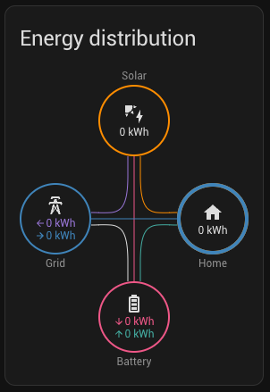
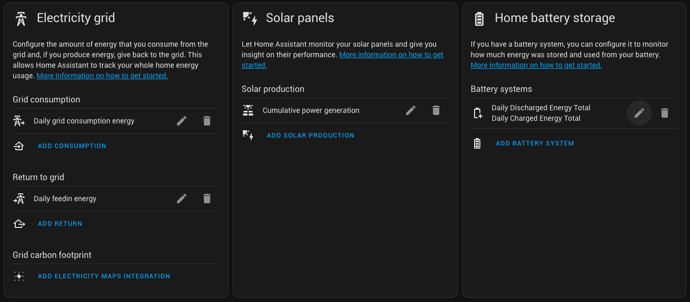

# FoxESSCloud API Integration for Home-Assistant

This is a custom component for Home Assistant to provide access to the data of your FoxESS photovoltaics inverter data.

It uses a subset of the official API of FoxESSCloud which can
be [found here](https://www.foxesscloud.com/public/i18n/en/OpenApiDocument.html).

## Installation

Use [hacs.xyz](https://hacs.xyz) to install and update it.

Add `https://github.com/SoftXperience/home-assistant-foxess-api` to the user-defined repositories.

Then install this integration.

## Manual installation

Put content of `custom_components` folder into your Home-Assistant `/config/custom_components` folder.

## Configuration

Add the integrations from the integrations dashboard. Enter your API key and the inverter serial number.

You can find these data in the FoxESSCloud portal. The API key can be generated in your user profile.

## Energy dashboard

To use the data in your Home Assistant energy dashboard, use the following sensors:

* `sensor.<serial>_daily_grid_consumption` as _Grid consumption_
* `sensor.<serial>_daily_feedin` as _Return to grid_
* `sensor.<serial>_generation` as _Solar production_
* `sensor.<serial>_daily_charged_energy_total` as _Energy going in to the battery_ for battery system
* `sensor.<serial>_daily_discharged_energy_total` as _Energy coming out of the battery_ for battery system

The daily values will reset everyday, but Home Assistant will take care of the calculations.

## API calls rate limit

Each API key is limited to 1440 calls per day. As we need 2 calls per update, the update interval is set to 3 minutes to
be safe.
Also, according to my monitoring, the datalogger seems to only update every 4-6 minutes anyways. 